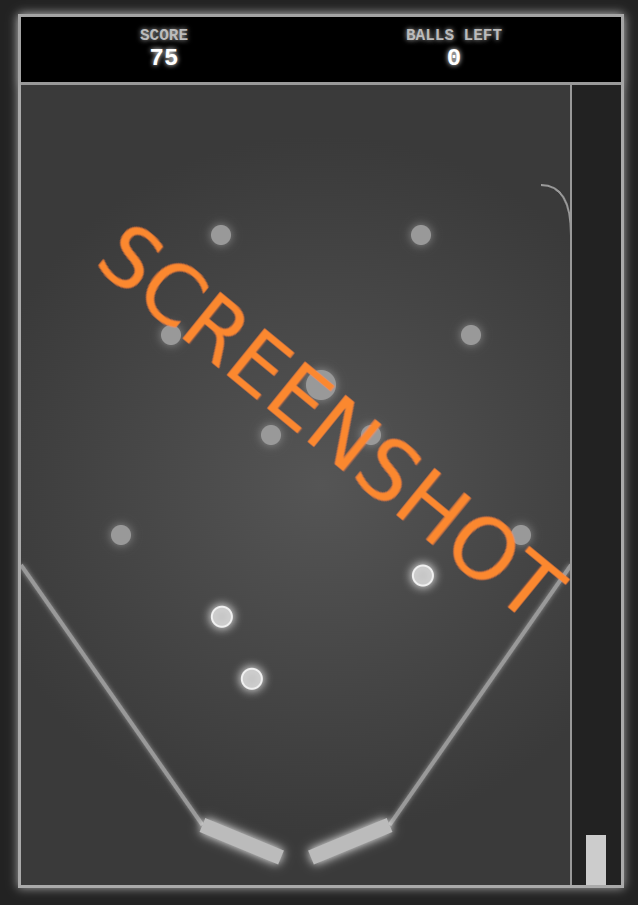

# js_flipper

# 🎮 Simple Flipper

A retro-inspired pinball game made with HTML5 Canvas and JavaScript. Use your keyboard to control the flippers and launch balls, rack up points by hitting bumpers, and avoid losing your ball through the center!

## Play it now: https://pemmyz.github.io/js_flipper/

### Game

## 🚀 Features

- ⚙️ Physics-based ball movement with gravity, friction, and bounce
- 🎯 Bumpers that score points and react with sound
- 🕹️ Left and right flippers controlled with keyboard
- 🔋 Manual plunger launcher (hold space to charge, release to launch)
- ⛔ Game Over screen with restart option
- 🆘 Toggleable in-game help/controls (press **H**)
- 🎧 Retro-style sound effects via Web Audio API
- 🧠 Anti-stuck logic to prevent endless bouncing near flippers or slopes

## 🎮 Controls

| Key           | Action                  |
|---------------|-------------------------|
| ⬅️ Left Arrow  | Left Flipper            |
| ➡️ Right Arrow | Right Flipper           |
| Spacebar      | Hold to charge plunger  |
| H             | Toggle Help Legend      |

## 🧠 Game Logic

- Balls are launched from a chute with chargeable power.
- Hitting bumpers increases score.
- When all balls are used and lost, the game ends.
- Anti-stuck logic detects repeated bounces and nudges the ball to keep gameplay flowing.

## 🛠️ Technologies Used

- **JavaScript (Vanilla)**
- **HTML5 Canvas**
- **Web Audio API**
- **CSS3 (Retro Dark Theme)**

## 💡 Future Ideas

- 🎨 Add themes or custom ball styles
- 💾 High score persistence with localStorage
- 🧱 Dynamic level design (bumper layout generator)
- 🎮 Mobile/touchscreen support

## 📜 License

MIT License.  
Feel free to use, modify, and learn from this project!

---

Made with ❤️/AI by pemmyz

